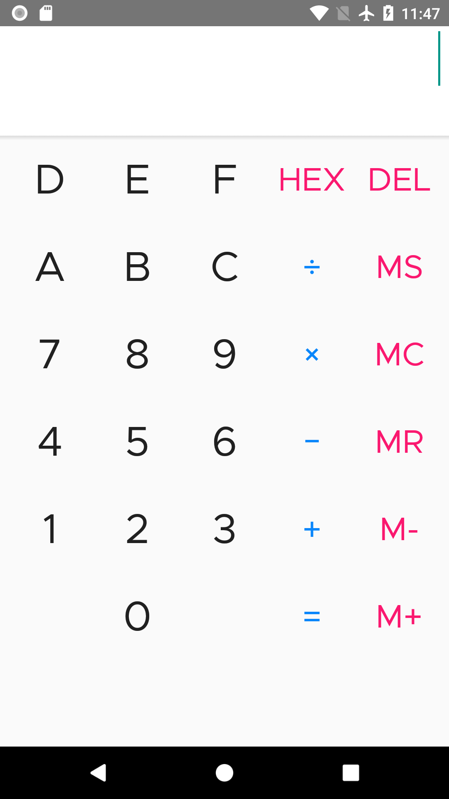
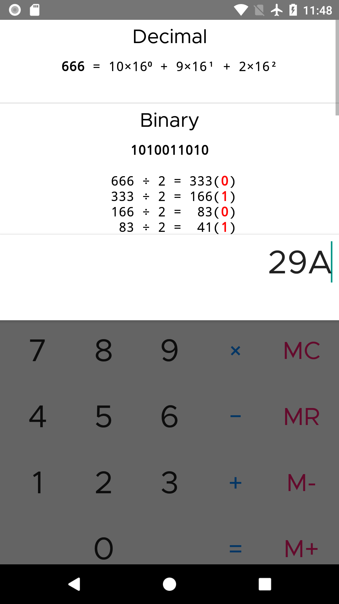

### Features

* Convert between base 2 <-> 8 <-> 10 <-> 16 with solution.
* Add, Substract, Multiply, Divide
* Convert expressions between systems
* Copy converted result to clipboard

### Screenshots

